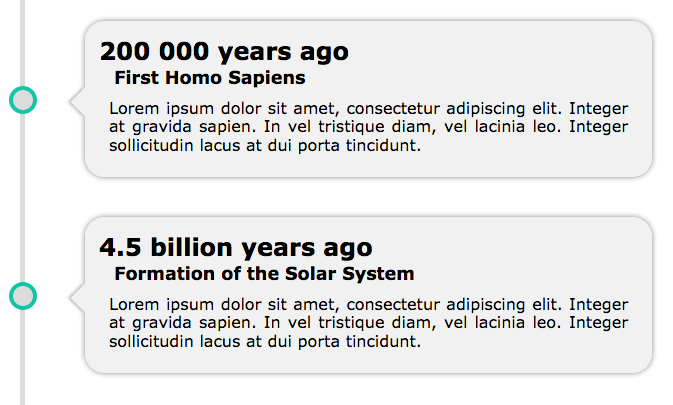

# Simple CSS Vertical Timeline
I could not find anything that suited me, so I created my own solution.
I hope you like it!

[Here is a demo](https://jsfiddle.net/mikasjp/uooksxdg/)



## How to use it?
1. First you need to attach the style.css file or its contents to the document where you want to create your timeline.
 ```html
 <link rel="stylesheet" href="style.css">
 ```
 or
 ```html
<style>
    The contents of the style.css file goes here
</style>
 ```
2. Now you can create your own timeline.
 ```html
 <div class="vtimeline">
     <ul>
         <li>
             <h1>Put your date here</h1>
             <h2>Put your title here</h2>
             <p>Describe event here</p>
         </li>
     </ul>
 </div>
 ```
 You can put as many events as you like. Just add more list items according to the example above.
 If you have any problems, just look at the demo.

3.  **[OPTIONAL STEP]** If you want, you can change the colors of the timeline elements. At the beginning of the style.css file there are variables that you can edit.
 ```css
 :root
 {
     /* Main */
     --vtimeline-bg-color: transparent;
 
     /* Branch */
     --vtimeline-branch-color: rgb(220, 220, 220);
     --vtimeline-circle-border-color: rgb(19, 196, 165);
     --vtimeline-circle-bg: rgb(220, 220, 220);
 
     /* Baloon */
     --vtimeline-baloon-bg-color: rgb(241, 241, 241);
     --vtimeline-baloon-border-color: rgb(241, 241, 241);
 }
 ```
 Just adapt them to your needs.